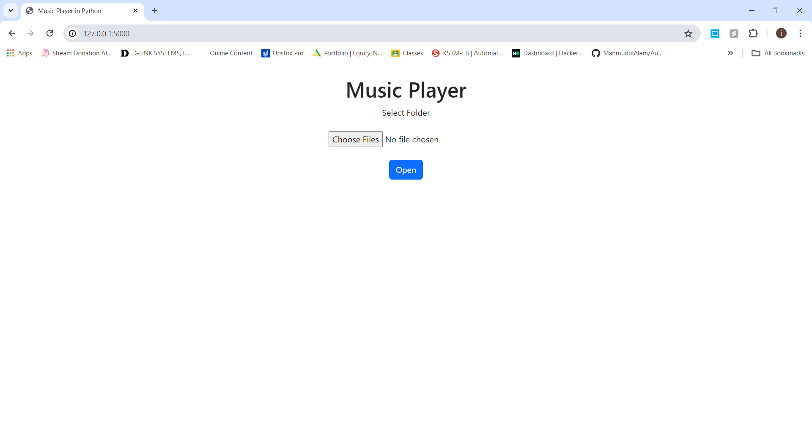

# Project - 2 - Music Player in Python

```
Project ID: #CC9864
Project Title: Music Player in Python
Internship Domain: Python Development Intern
```

### Project Overview

The Music Player project is a web application developed during my internship at CodeClause Pvt Ltd. The application allows users to upload and play MP3 files directly from their web browser. This project highlights my proficiency in Python, Flask, HTML, CSS, and Bootstrap.

### Key Features:
  1. User-Friendly Interface:
     - Simple and intuitive interface for easy interaction.
     - Clean and responsive web form for uploading MP3 files.
  2. File Upload Capability:
     - Supports multiple MP3 file uploads at once.
     - Convenient batch upload feature by selecting a folder.
  3. Audio Playback:
     - Built-in audio controls for playing, pausing, and adjusting volume.
     - Displays uploaded MP3 files with playback options.
  4. Responsive Design:
     - Uses Bootstrap for a mobile-friendly and responsive design.
     - Consistent experience across different devices and screen sizes.
  5. Server-Side File Handling:
     - Handles file uploads and storage securely using Flask.
     - Saves uploaded files in a designated folder on the server.
  6. Dynamic Content Rendering:
     - Uses Jinja2 templating to dynamically render the uploaded files list.
     - Automatically updates the dashboard with new uploads.
  7. Cross-Browser Compatibility:
     - Works seamlessly across major web browsers.
     - Ensures a consistent user experience.

### Technologies Used
  - `Python`: Core programming language used for backend logic.
  - `Flask`: Web framework used to build the web application.
  - `HTML`: Markup language used for structuring the web pages.
  - `CSS`: Used for styling the web pages.
  - `Bootstrap`: Framework used for creating responsive and mobile-first web designs.

### Code Explanation
  1. Flask Application (`app.py`):
       - This part of the code sets up the Flask application, defines routes, and handles file uploads.
  2. HTML Templates:
       - Index Page (`index.html)`: This page provides a form for users to upload MP3 files.
       - Dashboard Page (`Dashboard.html`): This page displays the uploaded MP3 files and provides audio controls for playback.

## How to Run the Project
## Version
```
Python >= 3.7.0 or anaconda
```

## Usage
Installation and Cloning Project:
```
git clone https://github.com/Jagadeeswar-reddy-c/CODECLAUSE.git
cd "Music Player in Python"
```
  1. Install Dependencies:
     -  Ensure you have Flask installed. You can install it using pip:
```
pip install Flask
```
  2. Run the Flask Application:
     - Navigate to the directory containing your Flask application and run:
```
python app.py
```
  3. Access the Application:
     - Open your web browser and go to
```
http://127.0.0.1:5000/
```
  4. Upload MP3 Files:
     - Use the form on the main page to upload MP3 files. The files will be saved to the `static/uploads/` directory.
  5. Play Music:
     - After uploading, the Dashboard page will display the uploaded files with audio controls for playback.

## Results
  - Before Uploading Files

  - After Uploading Files

  - Final Outcome


## Conclusion

The Music Player project developed during my internship at CodeClause Pvt Ltd showcases my proficiency in Python and web development. Utilizing Flask for the backend and HTML, CSS, and Bootstrap for the front-end, I created a user-friendly web application that allows multiple MP3 file uploads and provides built-in audio playback controls. This project highlights my ability to integrate various technologies to solve practical problems, enhancing my technical skills and preparing me for future software development challenges.
